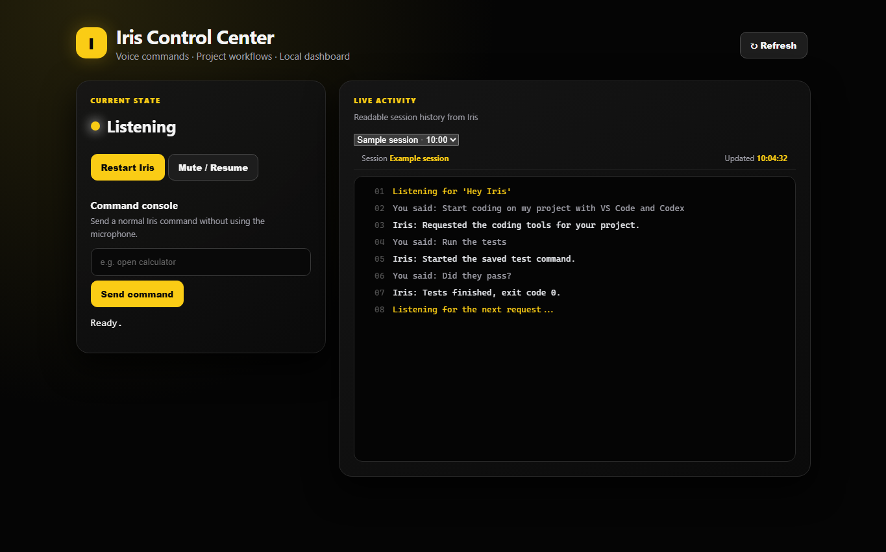

# Iris

A Windows voice assistant for everyday tasks and coding workflows.

Iris started with a simple goal: get things done on a PC without remembering
every command or opening every tool manually. Say “Hey Iris”, wait for her
response, and ask her to open an app, save a note, run a project's tests, or
start a coding session.

Speech recognition and request interpretation run locally. A browser dashboard
shows activity, project profiles, background jobs, and results.



Dashboard preview with sample activity.

## What works

- Wake-word listening, spoken replies, and tray controls.
- Opening installed apps and common folders, notes, screenshots, timers,
  volume controls, and web searches.
- Saved project profiles with editors, coding agents, and test/server/build commands.
- Shared voice and dashboard controls for jobs, with output, exit status,
  and stop buttons.
- Dated session logs and access to older history.
- Reviewed Codex tasks with streamed activity and final responses.

Editor launchers support VS Code, Cursor, and Windsurf. Agent launchers support
Codex CLI, Claude Code, Gemini CLI, and Aider when installed and available on
PATH. Direct task submission is currently implemented for Codex only.

## Try it

| Say after “Hey Iris” | Result |
| --- | --- |
| “Open Downloads” | Opens the folder in File Explorer. |
| “Take a note saying buy milk” | Saves a note and opens it in the default editor. |
| “Start coding on Iris with VS Code and Codex” | Launches the tools in the saved project folder. |
| “Run tests for Iris” | Runs the project's saved test command. |
| “Did they pass?” | Reports the recent task's status and exit code. |
| “Show what's using port 3000” | Starts a port diagnostic visible in job history. |
| “Stop the task I just started” | Stops the matching managed job. |
| “Ask Codex for Iris to explain the project structure” | Prepares a read-only agent task for approval. |

Use your own saved project name in place of “Iris”. Speak each follow-up after
the wake word. Clear requests work directly; less familiar developer phrasing
uses the local Qwen model.

## Setup

This is a Windows development project, not a packaged installer. It has been
tested with Python 3.13. The launchers currently assume an E: drive layout;
adjust those paths for your machine before running them. Developer project
folders must currently be on D: or E:.

1. Clone the repository into a folder on your data drive.
2. Create an environment and install dependencies from that folder:

   ```powershell
   py -m venv .venv
   .\.venv\Scripts\python.exe -m pip install --cache-dir .\pip-cache -r requirements.txt
   ```

3. Install Ollama on your chosen drive. Set its model directory before starting
   the server:

   ```powershell
   $env:OLLAMA_MODELS = 'E:\codex\iris-models'
   ollama serve
   ```

   In another terminal, with Ollama on PATH, run `ollama pull qwen3:4b`.
4. Download and extract the Vosk English model into
   `models/vosk-model-small-en-us-0.15/`. It is required for wake-word listening.
5. Whisper's `small.en` model downloads into `models/whisper` on first use.
   Allow extra time and an internet connection for that first download.
6. Check the Ollama paths in the launchers. Current defaults are
   `E:\codex\ollama\ollama.exe` and `E:\codex\iris-models`.

| Launcher | Purpose |
| --- | --- |
| `run_iris_tray.bat` | Hands-free Iris with a tray icon. |
| `run_iris_dashboard.bat` | Opens the developer dashboard once the server is ready. |
| `run_iris.bat` | Original terminal interface. |

Use one voice launcher at a time. The dashboard can run alongside it.
The control center is at `http://127.0.0.1:8765/`; the developer workspace is at
`http://127.0.0.1:8765/dev`. Use Project profiles to save folders, tools, and commands.

## Agent tasks and permissions

Codex requests default to read-only access. Review a request in the dashboard,
or say “approve agent task” for a single pending read-only request. File-changing
requests require dashboard approval. Requests expire after five minutes and
can only be approved once.

Saved project commands run immediately by voice after you approve and save the
profile. Manually entered PowerShell commands are reviewed before execution.
Run Iris as a normal Windows user. Stopping a job does not undo work already done.

The core voice assistant does not require a paid API. Web searches need internet
access. Optional coding agents use their own accounts, permissions, and usage
limits. Codex may send project context to its provider; those tasks are not offline.
See the [Codex task documentation](https://learn.chatgpt.com/docs/non-interactive-mode).

## Data and architecture

Private runtime data is excluded from Git:

- `data/notes` and `data/screenshots`: personal files.
- `data/logs`: dated voice-session logs.
- `data/dev`: job records, output, and agent responses.
- `data/projects.json`: project profiles.
- `models`: downloaded speech models and caches.

`assistant.py` handles listening and everyday actions. The voice worker and
dashboard call a separate local task service, which owns running jobs.
Project actions live in `iris_tasks.py`; launching and agent adapters are in
`iris_dev.py` and `iris_agents.py`. The service listens on loopback port 8766
and uses a local runtime token.

## Current limitations

- Speech recognition can mishear names; saved profiles reduce repetition.
- Spotify requests open search results, not guaranteed playback.
- Timers require the voice process to remain running.
- Jobs survive dashboard restarts, but restarting the task service loses control
  of active jobs. They may continue running and are marked untracked.
- Multi-step planning and administrator workflows are not implemented yet.
- A successful agent exit does not prove that a coding task was solved. Review
  the response, changes, and tests. Read-only submission has been tested end to
  end; file-editing tasks still need end-to-end validation.

## Tests

```powershell
.\.venv\Scripts\python.exe -B -m unittest discover -v
```

Tests cover command execution, cancellation, profiles, voice routing, approvals,
and local service request protection. They do not submit paid coding-agent
requests. Some tests launch short-lived PowerShell processes.

## Next

Multi-step project workflows, clearer task disambiguation, service-readiness
checks, and additional agent adapters.
